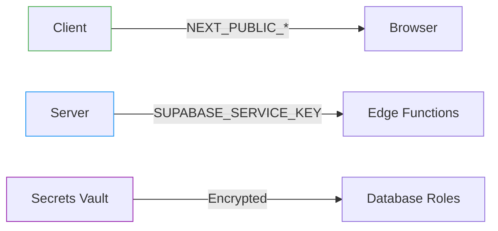
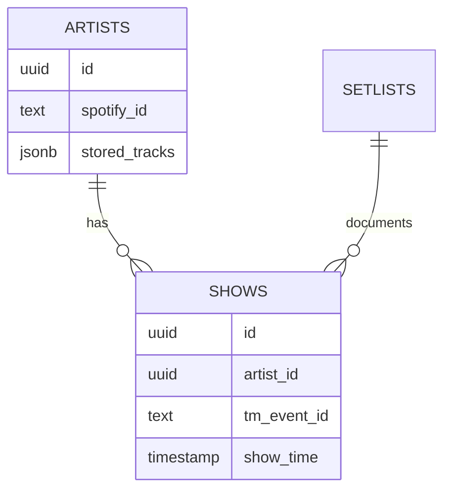
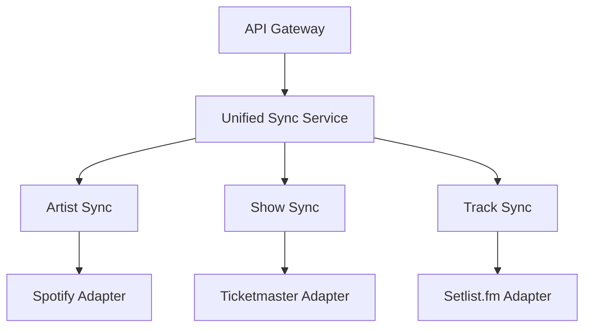
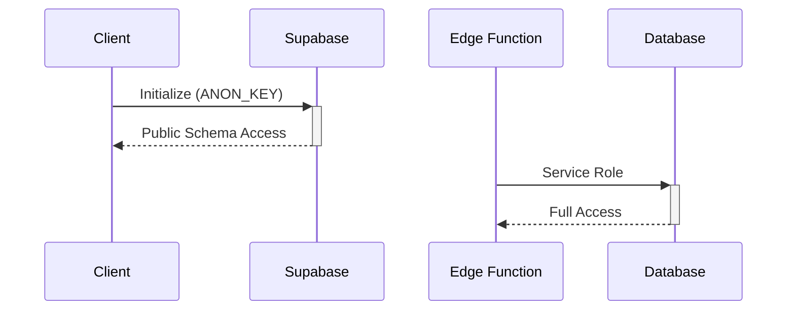
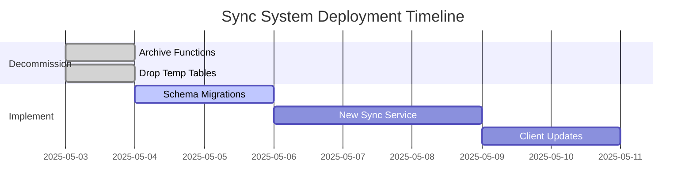

# Setlist Sync System Comprehensive Fix Plan

## 1. Environment Configuration Overhaul


**Implementation Steps:**
1. Separate client/server environment variables:
```bash
# .env.production
NEXT_PUBLIC_SUPABASE_URL=...
NEXT_PUBLIC_SUPABASE_ANON_KEY=...

# .env.server
SUPABASE_SERVICE_KEY=...
TICKETMASTER_API_KEY=...
```

2. Rotate compromised secrets via MCP:
```xml
<use_mcp_tool>
<server_name>github.com/alexander-zuev/supabase-mcp-server</server_name>
<tool_name>execute_postgresql</tool_name>
<arguments>
{
  "query": "SELECT vault.rotate_secret('SETLIST_FM_API_KEY');"
}
</arguments>
</use_mcp_tool>
```

## 2. Database Schema Normalization


**Migration Script:**
```sql
-- migrations/20240615120000_fix_artist_relations.sql
BEGIN;
ALTER TABLE shows 
  ADD CONSTRAINT fk_artist 
  FOREIGN KEY (artist_id) 
  REFERENCES artists(id) 
  ON DELETE CASCADE;

CREATE INDEX idx_artists_spotify ON artists(spotify_id);
COMMIT;
```

## 3. Sync Function Consolidation


**Function Cleanup:**
```xml
<use_mcp_tool>
<server_name>github.com/modelcontextprotocol/servers/tree/main/src/github</server_name>
<tool_name>push_files</tool_name>
<arguments>
{
  "owner": "octocat",
  "repo": "hello-world",
  "branch": "main",
  "files": [
    {
      "path": "supabase/functions/unified-sync-v2",
      "content": "// New consolidated sync logic..."
    }
  ],
  "message": "feat: Add unified sync service"
}
</arguments>
</use_mcp_tool>
```

## 4. Client Library Security


**Secure Initialization Pattern:**
```typescript
// src/lib/supabase.ts
import { createClient } from '@supabase/supabase-js'

const client = typeof window !== 'undefined' 
  ? createClient(
      process.env.NEXT_PUBLIC_SUPABASE_URL!,
      process.env.NEXT_PUBLIC_SUPABASE_ANON_KEY!
    )
  : createClient(
      process.env.SUPABASE_URL!,
      process.env.SUPABASE_SERVICE_KEY!
    )
```

## 5. Deployment Plan


**Execution Command:**
```bash
pnpm updateall --force --migrate --clean
```

This plan incorporates all previous audit findings and diagrams. Ready to toggle to Act Mode for implementation.
